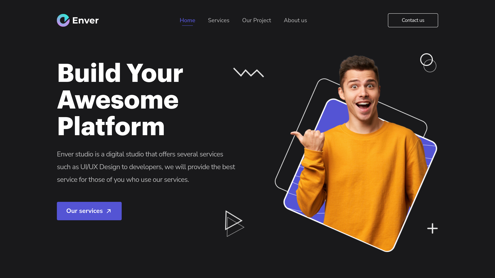

<h1 align="center">
  Agência Digital Enver
</h1>

<p align="center">
  
  
  
  
  

  <a href="https://github.com/leovargasdev/digital-agency-enver/commits/master">
    
  </a>
  
  <a href="https://github.com/leovargasdev/digital-agency-enver/issues">
    
  </a>
</p>

<p align="center">
  
</p>

## 💻 Projeto

Esse projeto foi desenvolvido durante uma _livecoding_ na [Twitch.tv](https://www.twitch.tv/leovargasdev).
O protótipo desse website foi desenvolvido pelo [**Fauzan Ardhiansyah**](https://www.figma.com/@ozanardhi), [clique aqui](https://www.figma.com/file/lOJDpQXKXmSKGQ1sjbsQRh?node-id=2%3A472) para abrir o protótipo no figma.

Dependências usadas no projeto:

-  [Next.js](https://nextjs.org/)
-  [Sass](https://sass-lang.com/)
-  [TypeScript](https://www.typescriptlang.org/)

Também foi adicionado as ferramentas [**ESLint**](https://eslint.org/) e [**Prettier**](https://prettier.io/) para aumentar a produtividade e auxiliar a manter um padrão de código.

## 📥 Instalação e execução

Faça um clone desse repositório e acesse o diretório.

```bash
# Instalando as dependências
$ yarn

# Executanto aplicação
$ yarn next
```
